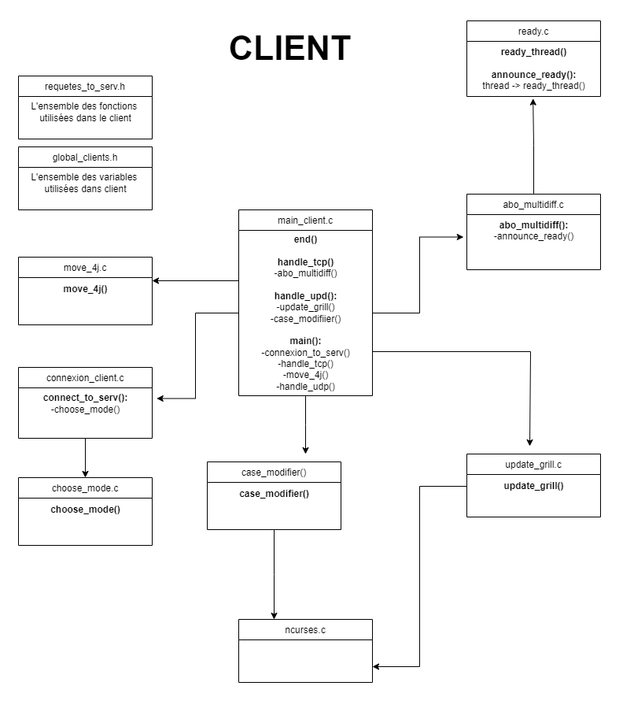
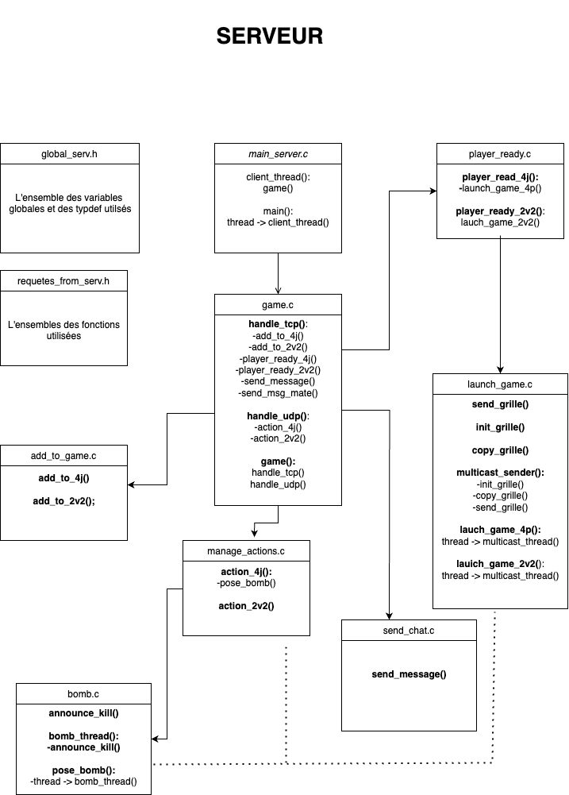

# BOMBERMAN PROJECT

Here's an explanation of how our Bomberman project works.## Project structure

The project is divided into two main parts:
- **Client** : Contains all the code needed for the game's client interface.
- **Server** : Manages the server logic for the game.


## Compilation

The project uses a `Makefile` in the root directory which invokes the `Makefile` in the `client` and `server` sub-folders.

1. Open a terminal in the project root directory.
2. Run the following command to compile the project:
```bash
make
```

## Launching the server

Once compilation is complete, you can launch the server with the following command:

```bash
make server_run
```
and a client with the following command
```bash
make client_run
```

Make sure the server is running before launching client instances.

Game properties (number of players in a game, grid dimensions) are available in the file `serveur/globals_serv.h`.

## Play

When the customer logs in, he/she must enter the game mode he/she wishes to join:
- 1 - Every man for himself mode
- 2 - 2v2 mode
- p or P - Quit the game

Once the choice has been made, the customer must declare himself ready. He has 60 seconds to send any message before the server exits the game.


## Keys
- **Move:** Arrows up, down, left, right
- **Place bomb:** F1
- **Write message in chat :** Write message
- **Send message:** F4


## Stop

To stop the server or a client, use `Ctrl+C` in the corresponding terminals.

## More information

Here are the structures of the 2 project subfolders:




